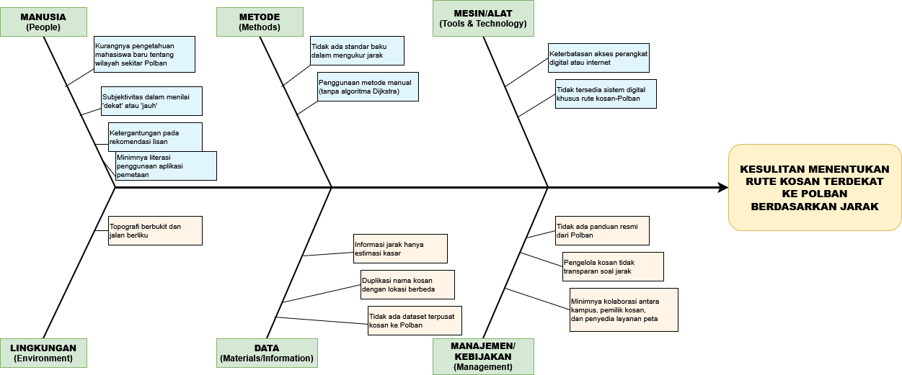

# 🏠 MockupKost

Repository ini dibuat sebagai bagian dari **Tugas Besar Mata Kuliah Matematika Diskrit (Post UTS)**. Tujuannya adalah untuk mendemonstrasikan penerapan **graf (graph)** menggunakan library **NetworkX** dalam sebuah aplikasi GUI berbasis **NiceGUI**.

Aplikasi ini menampilkan **mockup peta kos-kosan**, di mana setiap kamar atau lokasi direpresentasikan sebagai **node**, dan hubungan antar lokasi (misalnya jalan atau akses) direpresentasikan sebagai **edge**. Dengan pendekatan ini, pengguna dapat memahami bagaimana struktur graf digunakan dalam pemodelan dunia nyata.

---

## 🐟 Fishbone/Ishikawa Diagram

---

## 🎯 Fitur Utama

- Visualisasi graf kos-kosan secara interaktif
- Representasi node dan edge menggunakan NetworkX
- Antarmuka pengguna berbasis web dengan NiceGUI
- Demonstrasi konsep dasar teori graf: derajat node, jalur, konektivitas, dll.

## 🛠️ Dependencies/Requirements

- **Python 3.8+**
- **[NiceGUI](https://nicegui.io/)** – Framework GUI modern berbasis web
- **[NetworkX](https://networkx.org/)** – Library untuk membuat, memanipulasi, dan mempelajari struktur graf
- **Matplotlib** - Untuk Visualisasi
- **Pandas**
- **Scipy**
